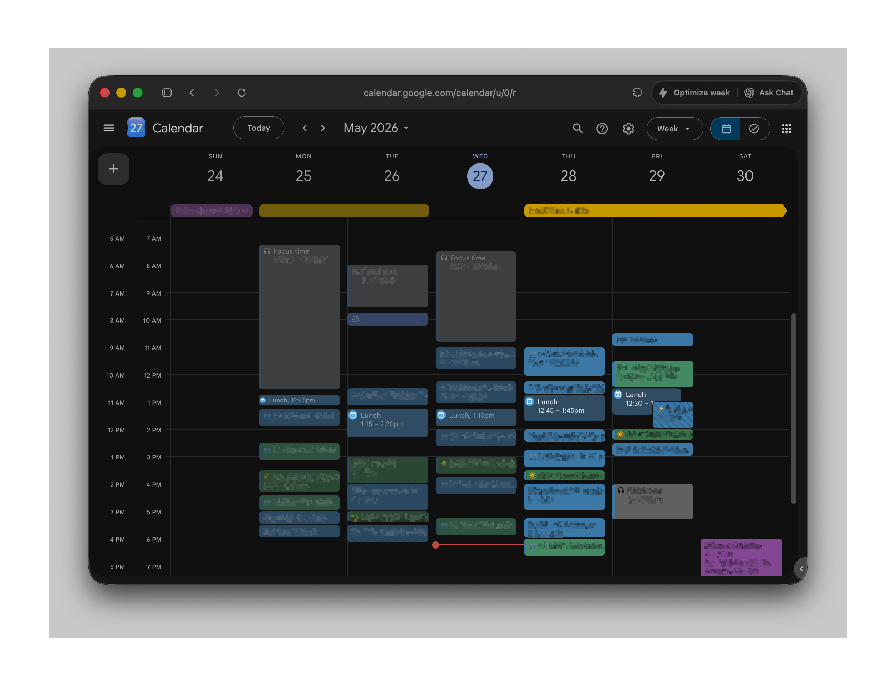

# meeting-auto-scheduler

<p align="center">
  
</p>

A collection of Google Calendar automation scripts to protect your time — block your lunch break, fill free gaps with Focus Time, mirror personal appointments to your work calendar, and keep meetings from eating your day.

| Script                          | What it does                                   | Platform           |
| ------------------------------- | ---------------------------------------------- | ------------------ |
| `src/lunch-scheduler.sh`        | Schedules a daily Lunch OOO around meetings    | macOS / Linux      |
| `src/lunch-scheduler.gs`        | Same, runs in the cloud                        | Google Apps Script |
| `src/focus-time-scheduler.gs`   | Fills free gaps with Focus Time events         | Google Apps Script |
| `src/personal-calendar-sync.gs` | Mirrors personal calendar events as OOO blocks | Google Apps Script |

---

## Lunch Scheduler

Automatically schedules a daily "Lunch" Out-of-Office block on Google Calendar, working around existing meetings.

### What it does

For every weekday in a rolling window (today through Friday of the current week + `--window-weeks`), the script:

- Skips days with an all-day PTO/OOO block
- Leaves existing Lunch events alone if no meetings conflict
- Deletes and reschedules a conflicting Lunch to the next best slot
- Creates a new Lunch OOO event on days that have none

"Maybe" and "Declined" RSVP responses are treated as free time and don't block a slot.

### Priority logic

Start times tried in order (default): `12:30 → 12:15 → 12:45 → 12:00 → 13:00 → 13:15 → 11:45 → 13:30 → 11:30`

Durations tried longest-first (default): `60 → 45 → 30 → 15 minutes` (event must end by `--max-end`, default `14:00`)

### Requirements

- [`gogcli`](https://github.com/steipete/gogcli) — `brew install steipete/tap/gogcli`
- `jq` — `brew install jq`
- macOS or Linux (`date` — BSD or GNU, auto-detected)

Authenticate once before running:

```bash
gog auth add you@example.com --services calendar
```

### Usage

```bash
./src/lunch-scheduler.sh <email> [options]
./src/lunch-scheduler.sh --account <email> [options]

OPTIONS
  <email>                    Google account to use (required, positional or --account)
  --account <email>          Google account to use (same as positional)
  --timezone <tz>            IANA timezone name (default: system timezone)
  --calendar <name>          Calendar name or ID (default: primary)
  --start-times <HH:MM,...>  Preferred start times, tried in order
                             (default: 12:30,12:15,12:45,12:00,13:00,13:15,11:45,13:30,11:30)
  --durations <min,...>      Durations in minutes to try, longest first
                             (default: 60,45,30,15)
  --max-end <HH:MM>          Latest time lunch may end (default: 14:00)
  --window-weeks <n>         Weeks ahead beyond current week to schedule (default: 2)
  --decline-message <msg>    Message sent when declining meetings
  --dry-run, -n              Preview only, no changes made
```

### Examples

```bash
# Normal run (email as positional)
./src/lunch-scheduler.sh you@example.com

# Dry run to preview what would be scheduled
./src/lunch-scheduler.sh you@example.com -n

# Custom preferences
./src/lunch-scheduler.sh you@example.com \
  --timezone America/New_York \
  --start-times 12:00,12:30,13:00 \
  --durations 60,30 \
  --max-end 13:30
```

### Example output

```bash
[08:00:01] === Lunch Scheduler ===
[08:00:01] Account:      you@example.com
[08:00:01] Timezone:     America/New_York
[08:00:01] Calendar:     primary
[08:00:01] Window:       2026-05-27 → 2026-06-12  (current week + 2)
[08:00:01] Start times:  12:30,12:15,12:45,12:00,13:00,13:15,11:45,13:30,11:30
[08:00:01] Durations:    60,45,30,15 min
[08:00:01] Max end:      14:00
[08:00:01] Fetching events from Google Calendar…
[08:00:02] Fetched 23 events
[08:00:02] ✓  2026-05-27  Lunch 12:30–13:30 — OK, no conflicts
[08:00:02] ⚡ 2026-05-28  Lunch 12:30–13:30 — conflict detected, rescheduling
[08:00:02] ✅ 2026-05-28  Creating Lunch OOO  13:00–14:00  (60 min)
[08:00:03]    Created ✓
[08:00:03] ✅ 2026-05-29  Creating Lunch OOO  12:30–13:30  (60 min)
[08:00:04]    Created ✓
[08:00:04] ⏭  2026-05-30  PTO/all-day OOO — skipping
[08:00:04] ❌ 2026-05-31  No lunch slot available (fully booked until 14:00)
[08:00:04] ✅ 2026-06-02  Creating Lunch OOO  12:15–13:15  (60 min)
[08:00:05]    Created ✓
[08:00:05] ⏭  2026-06-03  Already OOO during lunch window — skipping
[08:00:05] ✅ 2026-06-04  Creating Lunch OOO  12:30–13:00  (30 min)
[08:00:06]    Created ✓
[08:00:06] === Done ===
```

Dry-run output looks the same but all `Creating` lines are prefixed with `[dry-run]` and no calendar changes are made.

### Automation

Use the setup script to install or remove the scheduled job:

```bash
# Interactive — prompts for cron or launchd
./src/setup-schedule.sh you@example.com

# Explicit method
./src/setup-schedule.sh you@example.com --method launchd
./src/setup-schedule.sh you@example.com --method cron

# Custom time (default: 08:00)
./src/setup-schedule.sh you@example.com --hour 9 --minute 30

# Remove
./src/setup-schedule.sh --method launchd --remove
./src/setup-schedule.sh --method cron --remove
```

**launchd** (macOS only) — recommended: survives sleep/wake and reboots, fires even if the machine was asleep at the scheduled time.

**cron** — simpler, works on macOS and Linux.

When no `--method` is given, the script prompts interactively. On macOS it defaults to **launchd**; on Linux it skips the prompt and uses **cron** automatically.

## Google Apps Script (cloud, no local setup)

`src/lunch-scheduler.gs` is a self-contained version that runs entirely inside Google's platform — no terminal, no `gog`, no cron/launchd needed.

### Deploy via clasp (recommended)

[`clasp`](https://github.com/google/clasp) is Google's CLI for Apps Script and lets you push directly from the repo.

```bash
# Install clasp and authenticate
npm install -g @google/clasp
clasp login

# Create a new Apps Script project (run once)
cd src
clasp create --title "lunch-scheduler" --type standalone

# Push the script to Google
clasp push

# Open the project in the browser to finish setup
clasp open
```

### Deploy manually

1. Go to [script.google.com](https://script.google.com) → **New project**
2. Delete the default code, paste the contents of `src/lunch-scheduler.gs`
3. Save (`Ctrl+S`)

### Finish setup (both methods)

1. **Services** (+) → search **Google Calendar API** → **Add** (v3 is required)
2. Edit the `CONFIG` block at the top of the code if needed (calendar, times, etc.)
3. Run `scheduleLunch()` once to grant permissions and verify it works
4. Run `setupTrigger()` to install the daily trigger

Logs appear in **View → Logs** (or `Ctrl+Enter`). Set `DRY_RUN: true` in `CONFIG` to preview without making changes.

**Remove**

Run `removeTrigger()`, or go to **Triggers** in the left sidebar and delete it manually.

## Focus Time Scheduler (Google Apps Script)

`src/focus-time-scheduler.gs` fills every free gap of at least `MIN_DURATION_MINUTES` inside your configured working hours with a Google Calendar **Focus Time** event. It works around existing meetings, Lunch OOO blocks, and all-day PTO/OOO days.

**How it works**

- **Creates** Focus Time only **from now forward** — never schedules new blocks in the past (including earlier today)
- Walks each weekday in a rolling window (default: 1 week)
- Uses per-day `WORK_WINDOWS` (map of weekday → `{start,end}` slots; unlisted days use `default`; empty array = skip that day). Defaults: Mon–Thu `09:00–13:00` + `16:00–18:30`, Friday `09:00–18:30`, Sat/Sun off
- Creates Focus Time events (graphite/gray by default) that can auto-decline conflicting invites on a chosen weekday
- **Reconciles** instead of wipe-and-rebuild: removes an existing Focus Time block when it overlaps an accepted busy event (even if that block already started); non-conflicting blocks are left alone, then free gaps are refilled from now forward
- Tags script-created events with a private `ftManaged` extended property so the calendar-change trigger can ignore its own writes
- Skips days with no configured work windows, PTO/all-day OOO days, and events marked free when `IGNORE_FREE_EVENTS` is on
- Top-level helpers are prefixed with `FT` so this file can live in the same Apps Script project as the lunch scheduler without name collisions

**Setup**

1. Deploy alongside `lunch-scheduler.gs` (same Apps Script project or a new one) — Calendar API v3 advanced service must be enabled
2. Edit `FT_CONFIG` if needed (windows, duration, color, auto-decline weekday, etc.)
3. Run `scheduleFocusTime()` once to grant permissions and verify
4. Install a trigger (pick one or both):

| Trigger | Setup function | When it runs |
| ------- | -------------- | ------------ |
| Daily (time-based) | `setupFocusTimeTrigger()` | Once per day at `TRIGGER_HOUR` (default `7`) |
| Calendar-change | `setupFocusTimeCalendarTrigger()` | Whenever an event is created, updated, or deleted |

**Trigger ordering**

Keep `TRIGGER_HOUR` at least one hour after the Lunch scheduler's hour (default lunch `6`, focus `7`) so lunch blocks already exist and count as busy. Apps Script daily triggers fire at an arbitrary minute within the hour, so a one-hour buffer matters.

**Calendar-change trigger**

`onEventUpdated` fires on every calendar change, including ones this script just made. To avoid a feedback loop, the handler uses Calendar API incremental sync (`syncToken`) and skips runs when every changed event is self-caused:

- Inserts/updates carrying the `ftManaged` private property
- Deletes whose IDs were recently recorded in Script Properties (`SELF_REMOVAL_MEMORY_MINUTES`, default `20`)

Only genuine external changes (accepted/declined meetings, moved events, etc.) re-run the scheduler. A cooldown (`CALENDAR_TRIGGER_COOLDOWN_MINUTES`, default `5`) remains as a safety net if sync-token logic fails open.

You can use the calendar-change trigger alone, alongside the daily trigger, or stick with daily only.

**Remove**

- Daily: `removeFocusTimeTrigger()`
- Calendar-change: `removeFocusTimeCalendarTrigger()`
- Or delete either from **Triggers** in the left sidebar

## Personal Calendar Sync (Google Apps Script)

`src/personal-calendar-sync.gs` mirrors busy events from a personal Google Calendar into your work calendar as OOO blocks — so personal appointments block your work slots without exposing their details.

**How it works**

- Reads your personal calendar over a rolling window (default: 4 weeks)
- Creates a `Busy (personal)` OOO block on your work calendar for each busy event
- On every run: updates time-shifted events, removes mirrors whose source was deleted
- Skips events you've declined or marked as free
- Tags each mirror with the source event ID so re-runs stay idempotent

**Setup**

**Step 1 — Share your personal calendar with your work account**

1. Open Google Calendar logged into your **personal** account
2. Settings (gear icon) → Settings → click your personal calendar in the left sidebar
3. Click **"Shared with"** → **"+ Add people and groups"**
4. Add your work email with **"See all event details"** permission and save

**Step 2 — Find your personal calendar ID**

1. Still in personal calendar settings, click **"Integrate calendar"**
2. Copy the **Calendar ID** (looks like `you@gmail.com` or `abc123@group.calendar.google.com`)

**Step 3 — Configure and deploy**

1. Open `src/personal-calendar-sync.gs` and paste the Calendar ID into `PERSONAL_CALENDAR_ID` in `SYNC_CONFIG`
2. Deploy alongside `lunch-scheduler.gs` (same Apps Script project or a new one)
3. Run `syncPersonalCalendar()` once to grant permissions and verify
4. Run `setupSyncTrigger()` to install an hourly trigger

**Remove**

Run `removeSyncTrigger()` to stop future syncs, then `removeMirroredEvents()` to delete all mirrored events from your work calendar.
